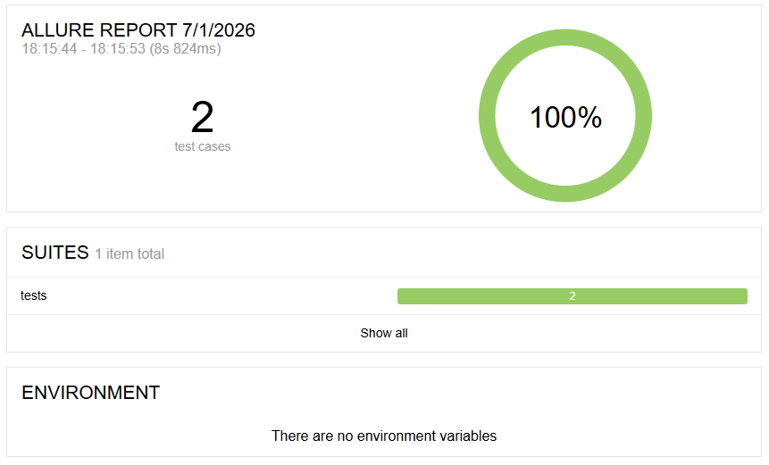

### Zus ☕ Technical Assessment | Python + Selenium + PyTest + Allure

This is a demo project showcasing my skills in UI test automation using the **Selenium WebDriver** and **PyTest** frameworks, with reporting via **pytest-html** and **Allure**.

---

## 📁 Project Structure

<details>
<summary><strong>Click to expand</strong></summary>

```plaintext
.
├── config/
│   └── constants.py                # contains the constant variable throughout the framework
├── pages/
│   ├── cart_page.py
│   └── checkout_complete_page.py
│   └── checkout_page.py
│   └── inventory_page.py
│   └── login_page.py
├── tests/
│   ├── test_invalid_login.py
│   └── test_purchase_flow.py
├── main.py                         # entry point to run tests and generate reports
├── conftest.py                     # PyTest fixtures (WebDriver setup/teardown)
├── requirements.txt                # dependencies
└── README.md                       # documentation
```

</details>

---

## 🚀 Getting Started

### 1️⃣ Clone the Repository

```bash
git clone https://github.com/wan-iqra/ZUS_Technical_Assessment.git
cd ZUS_Technical_Assessment
```

### 2️⃣ Install Dependencies

```bash
pip install -r requirements.txt
```

---

## 🧪 Running the Tests
---

### Run with Allure Reporting (if installed)

- Line **14** in `main.py` to run the tests.
- Line **15** in `main.py` to generate report:
  - Generate an **interactive** Allure report in `reports_allure/`
  - Automatically open the report

> 🛠️ Prerequisites:  
> - [Java SDK](https://www.oracle.com/java/technologies/downloads/)

Check if Java is installed:

```bash
allure --version
```

---

## ⚙️ Installing Allure CLI (via Scoop)

Run the following commands in **PowerShell**:

```powershell
Set-ExecutionPolicy -Scope CurrentUser -ExecutionPolicy RemoteSigned
iwr -useb get.scoop.sh | iex
scoop install allure
```

Check if Allure is installed:

```bash
allure --version
```

**Allure Report Example:**



---

## 🧰 Tools & Technologies

| Tool          | Description                         |
|---------------|-------------------------------------|
| Python 3.12+  | Programming language                |
| Selenium      | Web automation framework            |
| PyTest        | Python test framework               |
| Allure-pytest | Allure report plugin for PyTest     |

---

## ✅ Final Notes

- Screenshots in this README are for illustration only.
- If you encounter issues with reports not displaying, ensure dependencies and Java are correctly set up.

---
